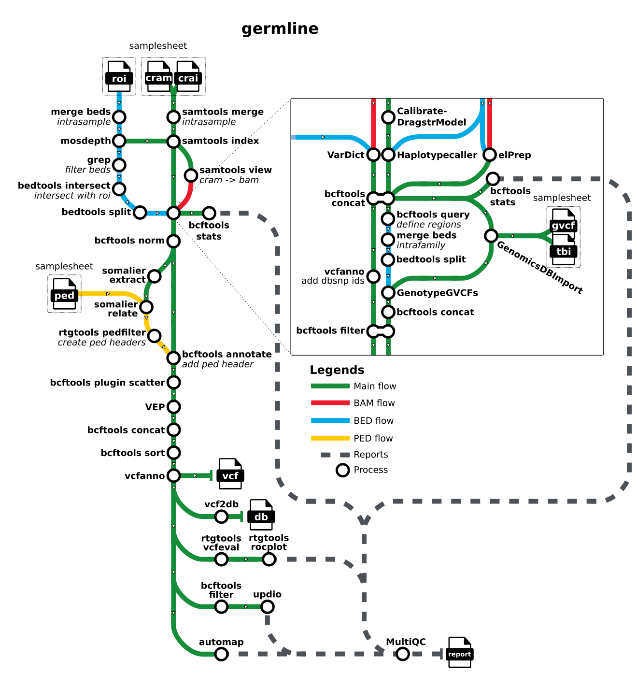

# nf-cmgg/germline

[](https://www.nextflow.io/)
[](https://www.docker.com/)
[](https://sylabs.io/docs/)
[](https://github.com/askimed/nf-test)

## Introduction

**germline** is a bioinformatics best-practice analysis pipeline for calling, joint-genotyping and annotating small variants variants for WGS and WES data. It uses HaplotypeCaller and/or Vardict to call variants, GenotypeGVCFs to genotype and EnsemblVEP to annotate.

The pipeline is built using [Nextflow](https://www.nextflow.io), a workflow tool to run tasks across multiple compute infrastructures in a very portable manner. It uses Docker/Singularity containers making installation trivial and results highly reproducible. The [Nextflow DSL2](https://www.nextflow.io/docs/latest/dsl2.html) implementation of this pipeline uses one container per process which makes it much easier to maintain and update software dependencies. Where possible, these processes have been submitted to and installed from [nf-core/modules](https://github.com/nf-core/modules) in order to make them available to all nf-core pipelines, and to everyone within the Nextflow community!

## Pipeline summary



:::note
If you are new to Nextflow and nf-core, please refer to [this page](https://nf-co.re/docs/usage/installation) on how
to set-up Nextflow. Make sure to [test your setup](https://nf-co.re/docs/usage/introduction#how-to-run-a-pipeline)
with `-profile test` before running the workflow on actual data.
:::

## Quick Start

1. Install [`Nextflow`](https://www.nextflow.io/docs/latest/getstarted.html#installation) (`>=23.10.0`)
2. Install any of [`Docker`](https://docs.docker.com/engine/installation/), [`Singularity`](https://www.sylabs.io/guides/3.0/user-guide/) (you can follow [this tutorial](https://singularity-tutorial.github.io/01-installation/)), [`Podman`](https://podman.io/), [`Shifter`](https://nersc.gitlab.io/development/shifter/how-to-use/) or [`Charliecloud`](https://hpc.github.io/charliecloud/) for full pipeline reproducibility _(you can use [`Conda`](https://conda.io/miniconda.html) both to install Nextflow itself and also to manage software within pipelines. Please only use it within pipelines as a last resort; see [docs](https://nf-co.re/usage/configuration#basic-configuration-profiles))_.

`samplesheet.csv`:

```csv
sample,family,cram,crai
SAMPLE_1,FAMILY_1,SAMPLE_1.cram,SAMPLE_1.crai
```

Each row represents a single sample to be analysed. More information can be found in the [usage](docs/usage.md) documentation.

-->

Now, you can run the pipeline using:

```bash
nextflow run nf-cmgg/germline --input samplesheet.csv --outdir <OUTDIR> --genome GRCh38 -profile <docker/singularity/podman/shifter/charliecloud/conda/institute>
```

> [!WARNING]
> Please provide pipeline parameters via the CLI or Nextflow `-params-file` option. Custom config files including those provided by the `-c` Nextflow option can be used to provide any configuration _**except for parameters**_;
> see [docs](https://nf-co.re/usage/configuration#custom-configuration-files).

## Credits

germline was originally written and is maintained by [@nvnieuwk](https://github.com/nvnieuwk).

Special thanks to [@matthdsm](https://github.com/matthdsm) for the many tips and feedback and to [@mvheetve](https://github.com/mvheetve) for testing the pipeline.

## Contributions and Support

If you would like to contribute to this pipeline, please see the [contributing guidelines](.github/CONTRIBUTING.md).

## Citations

An extensive list of references can be found in the [`CITATIONS.md`](CITATIONS.md) file.
